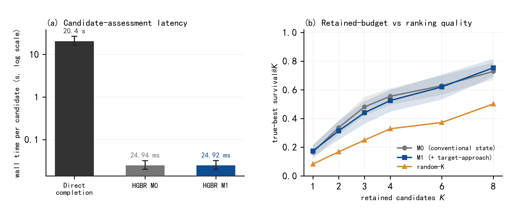
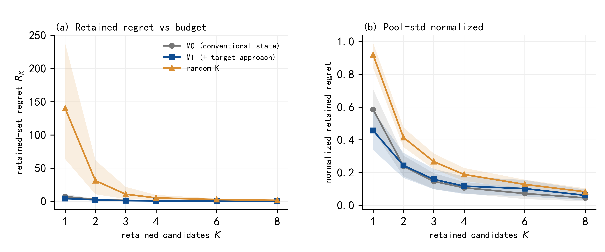
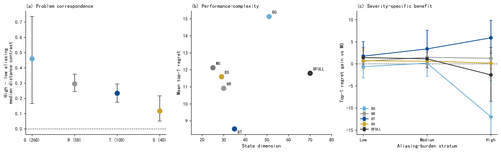
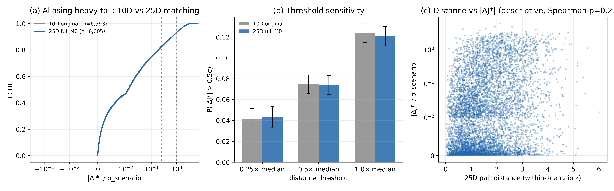
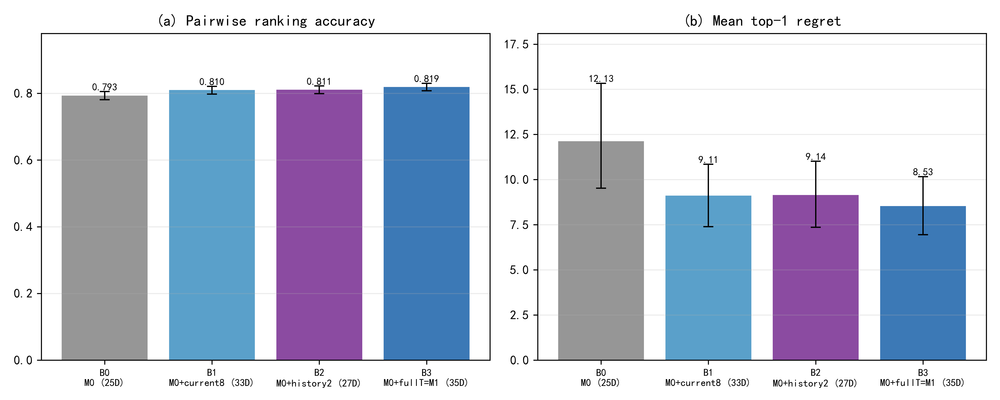
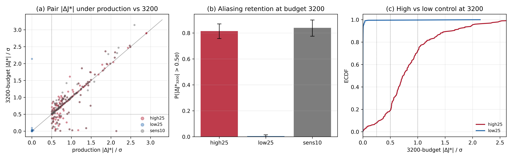

# Trajectory Design — Supplementary Experiments

Data, figures, and analysis scripts for the supplementary experiments accompanying the manuscript:

> **History-Conditioned Candidate Retention for Repairable Initialization in Well Trajectory Optimization**

The paper studies **state sufficiency** in sequential well-trajectory design: whether the state representation used by an AI-based candidate assessor contains enough task-relevant information to rank incomplete trajectory prefixes. This release contains two batches:

1. **Efficiency & specificity** (`exp30_`, `exp31_`): computational-efficiency evidence for the learned assessor and a post-selection specificity audit of the compact state correction.
2. **State-sufficiency extension** (`state_sufficiency_extension/`): five verification experiments (Exp A–E) probing the aliasing diagnosis itself — full-25D matched-pair audit, correction decomposition, decision-level mechanism, high-budget label relabel, and model-family robustness. See `experiments/state_sufficiency_extension/MASTER_REPORT.md`.

## Repository layout

```
figures/                              # Main result figures (600 dpi PNG)
scripts/                              # Exact experiment scripts (see note on dependencies below)
experiments/
  exp30_efficiency/                   # Experiment A+B: candidate-assessment efficiency
    technical_report.md               #   Full report (audit, numbers, claim boundaries)
    efficiency_summary.json           #   Headline latency / speedup numbers
    candidate_timing_summary.csv      #   Per-method timing summary
    candidate_timing_raw.csv          #   Per-candidate raw timings
    budget_tradeoff_summary.csv       #   Retained-budget K vs ranking quality
    budget_tradeoff_raw.csv
    amortized_cost.csv                #   Amortized cost vs number of candidates
    subset_ids.csv                    #   Stratified benchmark subset (selection rule included)
    run_manifest.json                 #   Environment, seeds, frozen-input hashes
  exp31_targeted_specificity/         # Experiment C: targeted correction specificity audit
    technical_report.md
    mechanism_group_summary.csv       #   Per-group aliasing-pair separation + Spearman
    mechanism_paired_contrasts.csv    #   T vs G/R/S paired contrasts
    pure_arm_ranking_summary.csv      #   M0 / M0+G / M0+R / M0+T / M0+S / full-history ranking
    ranking_paired_BT_vs_alternatives.csv
    burden_specificity_summary.csv    #   Gain vs M0 by aliasing-burden stratum
    table_burden_slopes.csv           #   Robust burden-slope regressions
    table_T_vs_alternatives_high_burden.csv
    performance_complexity.csv        #   Performance–complexity frontier data
    audit_manifest.json               #   Frozen-protocol anchors and reused modules
    group_feature_lists.json          #   Exact G / R / T / S feature definitions
  state_sufficiency_extension/        # Second batch: Exp A–E verification experiments
    MASTER_REPORT.md                  #   Cross-experiment final report + interpretation
    manuscript_implications.md        #   What the next manuscript revision should change
    expA_full25_aliasing/             #   Full-25D M0 matched-pair aliasing audit
    expB_T_decomposition/             #   current8 vs history2 decomposition of T
    expC_pair_decision/               #   Decision-level ordering on diagnosed pairs
    expD_highbudget_relabel/          #   3200-budget J* relabel of aliased pairs
    expE_model_robustness/            #   ExtraTrees / MLP robustness of the M1 gain
```

## Background

An AI-based candidate assessor (a frozen five-member histogram-based gradient-boosting regression ensemble, HGBR) predicts the completion-to-go quality `J*` of an incomplete trajectory prefix and ranks candidates for retention. Two state representations are compared under an identical architecture and training protocol:

- **M0** — 25-dimensional conventional checkpoint state;
- **M1** — M0 + a 10-dimensional compact target-approach correction (35D total).

## Experiment A — Candidate-assessment computational efficiency

On 270 held-out prefixes from 18 validation scenarios (same machine, same benchmark session):

| Method | Median time / candidate | Throughput |
|---|---|---|
| Direct completion search (production protocol) | 20.41 s | ~0.05 candidates/s |
| HGBR surrogate, M1 (feature extraction + 5-member inference) | 24.92 ms | ~20,700 candidates/s (batch) |
| HGBR surrogate, M0 | 24.94 ms | — |

- Median per-candidate speedup: **790×** (scenario-cluster bootstrap 95% CI 735–854; geometric mean 825×, CI 757–899).
- One-time offline training of the frozen M1 ensemble: **2.72 s** (9,597 rows, 988 scenarios) — break-even below a single direct evaluation.
- Extending the state from 25D to 35D changes online cost by <0.1%.



## Experiment B — Retained-candidate budget vs ranking quality

Top-K retention from the frozen validation pools (K = 1, 2, 3, 4, 6, 8):

- At K = 1, M1 significantly lowers retained-set regret vs M0 (Δ = −3.01, 95% CI [−6.03, −0.31]).
- True-best survival@K does not differ significantly at any K; **a reduction in retained-candidate budget is not demonstrated** (reported as a boundary result).



## Experiment C — Targeted correction specificity audit (post-selection)

The target-approach correction T (frozen by an earlier performance–complexity selection rule) is audited against the other engineering feature groups — geometry evolution (G, 26D), design-resource accounting (R, 5D), safety-corridor evolution (S, 4D) — on the identical population of 6,593 M0-matched prefix pairs:

- **Mechanism correspondence:** T is *not* the group most strongly associated with the diagnosed aliasing — R shows the highest distance↔|ΔJ*| association (median Spearman ρ = 0.375 vs 0.318 for T; paired difference −0.062, 95% CI [−0.081, −0.042]). This negative result is reported as-is.
- **Ranking (identical HGBR, only state columns differ):** M0+T achieves the lowest mean top-1 regret (8.53) and highest pairwise accuracy (0.819); paired improvements over **every** alternative — including the 70D full-history arm (Δregret +3.27, 95% CI [+1.59, +5.04]) — exclude zero.
- **Severity specificity:** only M0+T has a significantly positive aliasing-burden slope (+11.91, 95% CI [+2.90, +20.92], p = 0.0095); in the high-burden stratum its gain over M0 (+5.90, 95% CI [+2.45, +9.90]) significantly exceeds all alternatives.
- **Economy:** M0+T lies on the performance–complexity Pareto frontier and strictly dominates the 70D full-history arm at half the dimension. Adding the 26D geometry group *degrades* ranking below M0.



## State-sufficiency extension (Exp A–E)

Five verification experiments on the frozen pipeline (full details in `experiments/state_sufficiency_extension/MASTER_REPORT.md`; all CIs are scenario-cluster bootstrap, B = 1000, seed 2024):

- **Exp A — Full-25D aliasing audit.** Matching on the complete 25-variable M0 state (6,605 pairs) reproduces the 10D diagnosis almost exactly: median |ΔJ*|/σ = 0.0122 [0.0100, 0.0141], P(>0.5σ) = 0.121 [0.112, 0.130]. The heavy tail is not an artefact of the reduced matching vector.
- **Exp B — Correction decomposition.** The 10-variable correction T splits into current8 (task-relative endpoint geometry) and history2 (two prefix-history scalars). Each alone yields a comparable significant gain over M0 (Δregret +3.02 / +2.98); the full T is best on every metric (Case C: complementary, partially redundant). history2 alone (+2 dims) recovers ~83% of the full-T regret gain.
- **Exp C — Decision-level mechanism.** On the diagnosed matched pairs, the augmented state improves pair ordering over M0 (+4.2 points on 5,425 pairs; +2.5 points on the 797 high-aliasing pairs) and over shuffle/random controls on every stratum. The gain is broad, not concentrated in the severe tail (reported as observed).
- **Exp D — High-budget relabel.** Relabelling 862 prefixes at 8× the production completion budget (3200 evaluations) preserves pair ordering of high-aliasing pairs in 98.5% [96.9, 100] of cases and retains the 0.5σ heavy tail (81.5% [75.7, 87.0]); matched low-aliasing controls stay at 0.5%. Attenuation is confined to the >1σ extreme tail (28.5% retention) — finite-budget noise inflates the largest gaps but does not explain the aliasing. Determinism anchor vs the earlier budget audit: 2/2 recomputed prefixes exact.
- **Exp E — Model-family robustness.** The M1-over-M0 pairwise-accuracy benefit replicates across HGBR / ExtraTrees / MLP (+0.0263 / +0.0115 / +0.0225, all CIs exclude zero). The mean top-1 regret benefit does not replicate under the MLP (−2.33 [−4.75, −0.29]; median regret nonetheless improves) — the ranking benefit is learner-robust, the top-1 decision benefit is learner-dependent. Caveat: all 10 MLP members stopped at the library-default max_iter=200 unconverged (`mlp_convergence_diagnostics.json`), so the reversal characterises an undertrained reference.







## Reproducibility notes

- All confidence intervals use the **scenario** as the resampling unit (scenario-cluster bootstrap, B = 1000, seed 2024); candidate-level rows are never treated as independent samples.
- The scripts in `scripts/` are the exact experiment drivers. They import the project's frozen internal modules (feature extraction, completion oracle, HGBR training), which are not part of this release; the scripts are provided for protocol transparency rather than standalone execution. All reported numbers can instead be audited directly from the CSV/JSON files in `experiments/`.
- Nothing in the frozen protocol (M1 selection rule, train/validation split, labels, matched pairs, HGBR hyperparameters) was modified for these experiments; see `audit_manifest.json` / `run_manifest.json` for anchors and input hashes.
- Trained model binaries (~17 MB, joblib) are not included; the summary statistics they produced are fully tabulated in the CSVs.

## Claim boundaries

These experiments support statements about **candidate assessment** only:

- The HGBR surrogate makes completion-to-go assessment ~3 orders of magnitude cheaper — not "the whole optimizer is X× faster";
- M1 improves ranking quality with negligible extra online cost — not "total optimization cost is reduced by X%" (downstream evaluator budgets were not measured);
- M0+T is the best among the *tested* engineering corrections — not a universally optimal or minimal sufficient state;
- The state-augmentation benefit is learner-robust for pairwise ranking accuracy only — the MLP top-1 regret reversal is reported in full (Exp E);
- The aliasing heavy tail persists at 8× completion budget at the 0.5σ diagnostic threshold — but >1σ extreme-tail quantiles are partially label-noise-inflated (Exp D), and "label convergence" is not claimed.

## License

To be determined by the authors.
